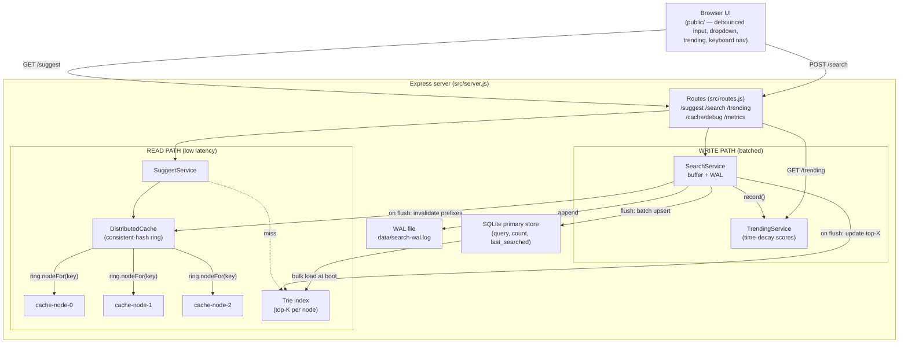

# Architecture

## Component diagram (Mermaid)



## ASCII view (read + write paths)

```
                              ┌──────────────────────────────┐
                              │        Browser UI             │
                              │  debounced typeahead, dropdown │
                              │  trending, keyboard nav        │
                              └───────────────┬───────────────┘
                                              │ HTTP
              ┌───────────────────────────────┼─────────────────────────────────┐
              │                Express server (routes.js)                        │
              │                               │                                   │
  GET /suggest?q=pre                 POST /search {query}              GET /trending
              │                               │                                   │
              ▼                               ▼                                   ▼
     ┌──────────────────┐         ┌────────────────────────┐          ┌──────────────────┐
     │  SuggestService  │         │     SearchService      │          │ TrendingService  │
     └───────┬──────────┘         │  (batch buffer + WAL)  │          │  decay scores    │
             │                    └───────┬──────────┬─────┘          └──────────────────┘
             ▼                            │ append    │ flush (size/interval)
 ┌────────────────────────┐              ▼           ▼
 │   DistributedCache      │       ┌──────────┐  ┌─────────────────────────────────────┐
 │  consistent-hash ring   │       │ WAL file │  │ 1) batch upsert  -> SQLite          │
 │  ┌──────┐┌──────┐┌─────┐│       │ (replay  │  │ 2) update Trie top-K (changed paths)│
 │  │node-0││node-1││node2││       │  on boot)│  │ 3) invalidate affected cache prefixes│
 │  └──────┘└──────┘└─────┘│       └──────────┘  └─────────────────────────────────────┘
 └───────────┬─────────────┘
   miss      │ hit -> return
             ▼
 ┌────────────────────────┐        ┌────────────────────────────┐
 │  Trie index (in-memory) │◀──────│  SQLite primary store       │
 │  precomputed top-K/node │ boot  │  (query, count, last_searched)
 └────────────────────────┘  load  └────────────────────────────┘
```

## Request flows

**Suggest (read):** `normalize(prefix)` → build cache key `mode:prefix` →
`ring.nodeFor(key)` picks one logical node → **hit** returns immediately; **miss**
reads the Trie's precomputed top-K, ranks (basic = count; enhanced = count+recency
blend), stores the result in that node with a TTL, returns.

**Search (write):** `normalize(query)` → append to WAL (durability) → add to the
in-memory aggregation buffer → bump the trending decay score → return
`{"message":"Searched"}`. A background flush (every `batchIntervalMs` or when the
buffer hits `batchMaxSize`) applies the whole buffer to SQLite in one transaction,
updates the Trie's top-K along changed paths, invalidates affected cache prefixes,
and truncates the WAL.

**Boot:** open SQLite → bulk-read all rows once → build the Trie → create the
cache ring → replay any leftover WAL entries → start the periodic flush → listen.
